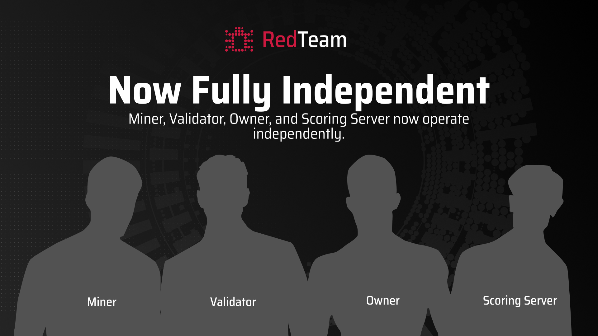

  <h1>Announcements</h1>
  
Official updates from the RedTeam. Check here for the latest news, event notices, and important messages. It's where we post what's new, what's coming, and what everyone should know.

    <a href="./posts/an.ada_detection_v2" class="blog-card-link">
        <article class="blog-card">
            

                
            

            

                
                    Feb 11, 2026
                
                <h2>
                    Release of Anti-Detect Automation Detection v2
                </h2>
                

                    ADA v2 introduces hardened browser obfuscation via NSTBrowser and a new Fail-Fast scoring logic across human, framework, and protocol detection pillars.
                

            

        </article>
    </a>
    <a href="./posts/an.what_is_changed" class="blog-card-link">
        <article class="blog-card">
            

                
            

            

                
                    Jan 29, 2026
                
                <h2>
                    Major System Updates and Repository Migration Complete
                </h2>
                

                    Repository migration is complete with HuggingFace dependency removed, humanize_behaviour_v5 deprecated, and enhanced security with encrypted commit display and early termination for invalid submissions.
                

            

        </article>
    </a>
    <a href="./posts/an.new_structure" class="blog-card-link">
        <article class="blog-card">
            

                
            

            

                
                    Jan 19, 2026
                
                <h2>
                    Repository split and migration deadline
                </h2>
                

                    We are separating the monolithic RedTeam repository into four focused projects. The split will be merged on Jan 25, 2026. Validators must migrate to the new dedicated validator repository or risk losing rewards.
                

            

        </article>
    </a>
    <a href="../blog/posts/an.ada_detection_v1/" class="blog-card-link">
        <article class="blog-card">
            

                
            

            

                
                    Dec 15, 2025
                
                <h2>
                    Release Anti-Detect Automation Detection v1
                </h2>
                

                    We are announcing the release of ada_detection_v1, a specialized challenge designed to evaluate detection capabilities within anti-detect browser environments (NST-Browser).
                

            

        </article>
    </a>
    <a href="../blog/posts/an.ab_sniffer_v5/" class="blog-card-link">
        <article class="blog-card">
            

                
            

            

                
                    Dec 02, 2025
                
                <h2>
                    Release Auto Browser Sniffer v5
                </h2>
                

                    We are announcing the release of ab_sniffer_v5, a major redesign of the Auto Browser Sniffer challenge. This update introduces a modular detection structure, a revised evaluation pipeline, stricter validation rules, and a more realistic containerized execution environment.
                

            

        </article>
    </a>
    <a href="../blog/posts/an.eslint_updates/" class="blog-card-link">
        <article class="blog-card">
            

                
            

                

                    Nov 22, 2025
                    <h2>
                        New ESLint Rules Go Live Nov 23
                    </h2>
                

                    Updated ESLint settings will apply to all JavaScript files beginning Nov 23, 2025. Learn what changed, why it matters for code quality and consistency, and how to test it.
                

            

        </article>
    </a>
    <a href="../blog/posts/an.fix-docker-in-challenges/" class="blog-card-link">
        <article class="blog-card">
            

                
            

                

                    Nov 16, 2025
                    <h2>
                        Docker v29: Pinning to v28 for Challenge Stability
                    </h2>
                

                    Docker v29 introduced breaking storage and runtime changes that caused DinD image-build failures; challenge runners are pinned to v28 and an opt-in compatibility toggle is available.
                

            

        </article>
    </a>
  <a href="../blog/posts/incentive-logic-update/" class="blog-card-link">
    <article class="blog-card">
        

            
        

        

            Oct 25, 2025
            <h2>Miner Linking & Incentive Logic Update</h2>
            
This improvement ensures that every miner is recognized fairly, no matter how many nodes or UIDs they operate.

        

    </article>
  </a>

  <!-- 2. Oct 15, 2025 - Auto Browser Sniffer -->
  <a href="../blog/posts/an.ab_sniffer_v4/" class="blog-card-link">
    <article class="blog-card">
        

            
        

        

            Oct 15, 2025
            <h2>Release of Auto Browser Sniffer</h2>
            
We are making important changes to improve fairness and protect miners' intellectual property

        

    </article>
  </a>

  <!-- 3. Oct 2, 2025 - Subnet Structure -->
  <a href="../blog/posts/an.structure-update/" class="blog-card-link">
    <article class="blog-card">
        

            
        

        

            Oct 2, 2025
            <h2>Update in Subnet Structure</h2>
            
Major changes to protect miners' intellectual property: hidden Docker Hub IDs, encryption detection, and dashboard improvements.

        

    </article>
  </a>

  <!-- 4. Feb 1, 2025 - Alpha Token -->
  <a href="../blog/posts/dynamic-tao-alpha-token/" class="blog-card-link">
    <article class="blog-card">
        

            
        

        

            Feb 1, 2025
            <h2>Alpha Token & Dynamic TAO</h2>
            
How Dynamic TAO and the Alpha token reshape RedTeam's decentralized cybersecurity incentives.

        

    </article>
  </a>

  <!-- 5. Jan 15, 2025 - Bot Challenges (OLDEST) -->
  <a href="../blog/posts/bot-detection-challenges/" class="blog-card-link">
    <article class="blog-card">
        

            
        

        

            Jan 15, 2025
            <h2>Bot Challenges Arrive to RedTeam</h2>
            
A new wave of bot detection challenges has been released to Subnet 61, advancing our security testing suite.

        

    </article>
  </a>

