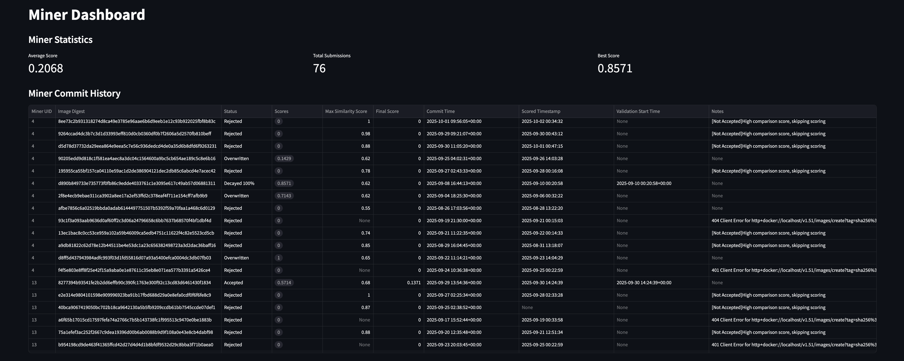

  <h1>Announcements</h1>
  
Official updates from the RedTeam.
Check here for the latest news, event notices, and important messages. It's where we post what's new, what's coming, and what everyone should know.

  <article class="blog-post">
    

      <h2><a href="../blog/posts/dynamic-tao-alpha-token/">Alpha Token & Dynamic TAO</a></h2>
      
How Dynamic TAO and the Alpha token reshape RedTeam's decentralized cybersecurity incentives.

      

        Feb 1, 2025
        ·
        Security Research, News
      

    

    

      
    

  </article>

  <article class="blog-post">
    

      <h2><a href="../blog/posts/bot-detection-challenges/">Bot Challenges Arrive to RedTeam</a></h2>
      
A new wave of bot detection challenges has been released to Subnet 61, advancing our security testing suite.

      

        Jan 15, 2025
        ·
        Challenges, News
      

    

    

      
    

  </article>

  <article class="blog-post">
    

      <h2><a href="../blog/posts/an.structure-update/">Update in Subnet Structure</a></h2>
      
Major changes to protect miners' intellectual property: hidden Docker Hub IDs, encryption detection, and dashboard improvements.

      

        Oct 2, 2025
        ·
        Announcement, News
      

    

    

      
    

  </article>

