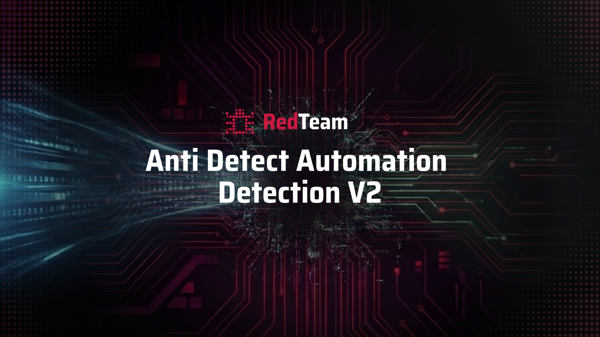

---
date:
    created: 2026-02-14T14:00:00
authors:
  - javokhir
categories:
  - Announcement
  - Release
tags:
  - challenge
  - ada-v2
  - anti-detect
  - automation
readtime: 6
title: "ADA v2: Hardened Detection & Fail-Fast Scoring"
---

# Next-Generation Automation Detection: Release of ADA v2



We are excited to announce the release of **Anti-Detect Automation Detection v2 (ADA v2)**. This major update raises the bar for detection difficulty through advanced browser-level obfuscation and a refined, fail-fast scoring architecture designed for maximum accuracy.

---

# What is new in ADA v2

## 🕵️‍♂️ Hardened Detection with NSTBrowser

ADA v2 leverages the full power of **NSTBrowser** to create highly realistic environments. By simulating authentic hardware fingerprints and disabling common automation signals at the engine level, static detection is now virtually impossible.

### Key Obfuscation Features

- **Dynamic Fingerprinting**: Every session generates unique, randomized browser identifiers.
- **Hardware Simulation**: Realistic signals for `deviceMemory` (8GB) and `hardwareConcurrency` (16).
- **Engine-Level Stealth**: Disables `AutomationControlled` flags and injects custom User-Agents across all network layers.

??? abstract "View Internal Browser Configuration"
    ```yaml
    platform: "Linux"
    headless: true
    incognito: true
    fingerprintRandomness: true
    fingerprinting:
      userAgent: "Mozilla/5.0 (Macintosh; Intel Mac OS X 10_15_7) ..."
      deviceMemory: 8
      hardwareConcurrency: 16
      screen:
        width: 1280
        height: 1024
    args:
      "--disable-blink-features": "AutomationControlled"
      "--disable-backgrounding-occluded-windows": true
      "--no-sandbox": true
    ```

## ➉ The Three Pillars of Fail-Fast Scoring

The scoring system has moved to a **Fail-Fast** model. If a submission fails any of these three critical pillars, the final score drops to **0.0** immediately.

### 1. Human Detection

Miners must distinguish between automated tasks and human-injected sessions.

- **Threshold**: Exceeding the allowed human miss count (default: 1) results in a total score of **0**.
- **Weight**: Perfect detection grants 1.0; partial penalties apply for minor misses.

### 2. Framework Detection

Identifies tools like `seleniumbase`, `puppeteer-extra`, and `zendriver`.

- **Selenium Safety Gate**: Missing any Selenium-based framework (`seleniumbase` or `selenium_driverless`) results in an immediate **0.0** total score. This is implemented because Selenium-based frameworks are the primary focus of ADA v2; missing them represents a failure to detect the challenge's main automation vectors.
- **Density**: Points are earned for every 3 correct detections.

### 3. Protocol Accuracy

Validates the low-level communication patterns (Webdriver/WebSocket) of the browser.

- **Verification**: Checks usage against expected framework profiles.
- **Threshold**: Exceeding protocol miss limits results in a total score of **0**.

!!! info "Final Formula"
    $$\text{Final Score} = \frac{\text{Human Score} + \text{Framework Score} + \text{Protocol Score}}{\text{Framework Count} + 2}$$

## 💰 Incentive Eligibility

To ensure high-quality detection, we have set a minimum performance threshold for incentive eligibility.

- **Minimum Score**: **0.6**
- **Rationale**: A perfect submission across all categories would yield a score of **0.8** (normalized), consisting of:
    - **Human Detection**: 0.1
    - **Protocol Detection**: 0.1
    - **Legacy Frameworks (4)**: 0.4
    - **Main Selenium Frameworks (2)**: 0.2
- **Buffer**: We have deducted **0.2** from the perfect baseline to arrive at the **0.6** eligibility threshold. This provides a buffer that accepts partial detection in human and protocol verification, provided the allowed miss limits are not exceeded. Additinally, it gives some chance for new miners to enter the incentive program while maintaining a high standard for detection quality.

# Infrastructure & Stability Updates

To ensure the platform remains fast and scalable, we've implemented several backend optimizations.

## Storage Optimization

We are now pruning comparison logs from validator state commits, retaining only the highest-scoring entry.
!!! note "Dashboard Visibility"
    This change is purely internal to reduce storage load. The **RedTeam Dashboard** will still visualize full comparison logs by sourcing them from our centralized scoring service.

## System Stability

- **[PR #104](https://github.com/RedTeamSubnet/RedTeam/pull/104)**: Removed redundant comparison logs from validators' state.
- **Cleanups**: Optimized abstract method implementations to improve validator runtime performance.

Need help with the migration? Reach out in our [Discord channel](https://discord.com/channels/799672011265015819/1319313447435108413).

*The RedTeam continues to push the boundaries of cybersecurity innovation. Stay tuned for more updates!*
