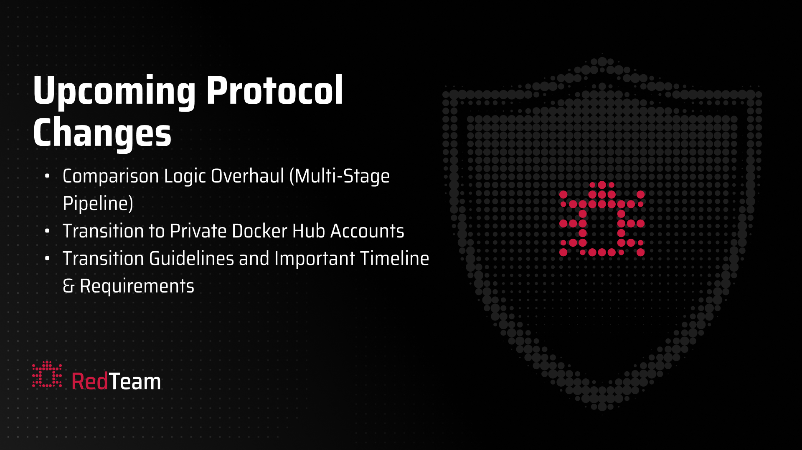

# Protocol Update: Comparison Logic Overhaul & Docker Transition

We are announcing two significant infrastructure updates aimed at improving the fairness and security of the RedTeam subnet. These changes include a comprehensive overhaul of our deduplication logic and a transition to private Docker Hub repositories for all miners.

## 1. Comparison Logic Overhaul (Multi-Stage Pipeline)

To ensure that emissions are fairly distributed among genuine miners, we are implementing a new multi-stage comparison pipeline. This overhaul addresses the issue of functionally similar submissions across multiple UIDs.

### New Flow Overview

The new system moves away from a single-threshold similarity check to a robust, four-stage gatekeeping process:

*   **Stage 1: Metadata Extraction:** All submissions will now undergo wall-clock execution timing, file size checks, memory usage tracking, and function call graph hashing.
*   **Stage 2: Score Progression Gate:** Submissions must strictly improve upon a UID's previous best score for the same challenge to proceed.
*   **Stage 3: Static Metadata Deduplication:** A high-speed check against existing submissions using the extracted metadata (runtime, size, memory, and structural hashes) to instantly catch obvious duplicates.
*   **Stage 4: Metadata-Enriched Validation:** Survivors of the static checks are compared using metadata-aware validation processes, making it significantly harder to game the system through superficial code variations.

This update is confined to the scoring server and internal services—**no validator-side changes are required**.

## 2. Transition to Private Docker Hub Accounts

Following the implementation of [PR #5](https://github.com/RedTeamSubnet/miner/pull/5), we are moving all miner-related Docker images to private repositories.

### Important Timeline & Requirements

*   **Deployment Date:** We will deploy the infrastructure updates this **Saturday, April 18th**.
*   **Action Required:** All miners **must** move their images to private Docker Hub accounts and configure their environments with Personal Access Tokens (PAT) before the deployment.
*   **Submission Freeze:** We strongly encourage miners **not to push new commits this Friday** to ensure stability and focus on preparing for these changes.

---

!!! warning "Preparation is Key"
    Please ensure your local environments are updated and your private Docker Hub accounts are ready before Saturday. Failure to move to private accounts may result in submission failures after the deployment.

*Stay vigilant and prepare for a more secure RedTeam ecosystem.*
