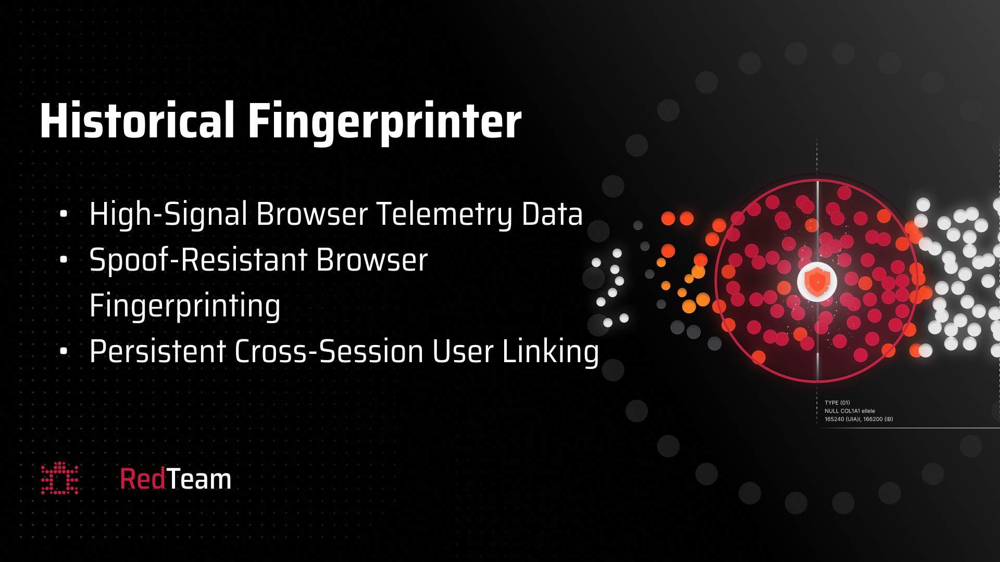

# Historical Fingerprinter & Repository Infrastructure Upgrades

We are excited to announce a major update to the RedTeam ecosystem. This release introduces a sophisticated new challenge, **Historical Fingerprinter**, alongside significant improvements to our repository's automation and community support infrastructure.

## New Challenge: Historical Fingerprinter (v1)

We are officially adding `historical_fingerprinter_v1` to our active challenge pool. This challenge replaces `ada_detection_v2` and focuses on advanced browser telemetry and persistent cross-session linking.

### Key Features

* **High-Signal Browser Telemetry:** Leverages deep browser data points for accurate identification.
* **Spoof-Resistant Fingerprinting:** Designed to withstand common browser obfuscation techniques.
* **Persistent User Linking:** Focuses on tracking and linking sessions across different timeframes and environments.

Validators and miners should update their local environments to include the new submodules and dependencies required for this challenge.

---

## Infrastructure & Automation Upgrades

Beyond the new challenge, we've implemented several "under-the-hood" enhancements to streamline development and community engagement.

### 1. AI-Assisted Changelog & Release Automation

We've integrated a new automation pipeline that analyzes commit history and submodule changes to generate detailed release notes.

* **Gemini Integration:** Our scripts now optionally leverage the Gemini API to provide intelligent summaries of technical changes.
* **Transparent Progress:** This ensures that every update is documented accurately and transparently for the community.

### 2. Streamlined Issue Templates

To help us handle community feedback and bug reports more efficiently, we've introduced new GitHub Issue Templates. You can now choose from specific categories when opening an issue:

* **Bug Reports:** Standardized format for reporting technical issues.
* **Feature Requests:** Propose new ideas for the subnet.
* **Challenge Feedback:** Specific templates for discussing challenges.
* **Documentation & Questions:** Dedicated paths for getting help or improving our docs.

### 3. Enhanced Security Reporting

The process for reporting security vulnerabilities has been clarified and integrated into our new issue workflow, making it easier for security researchers to responsibly disclose findings.

## Call to Action

!!! tip "Get Involved"
    We encourage all miners to start exploring the **Historical Fingerprinter** challenge. If you encounter any issues or have suggestions for the new automation features, please use our new **Issue Templates** on GitHub!

---
*Stay tuned for more updates as we continue to harden the RedTeam subnet.*
