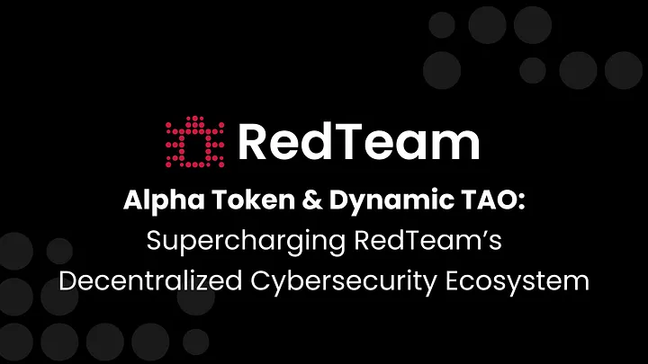
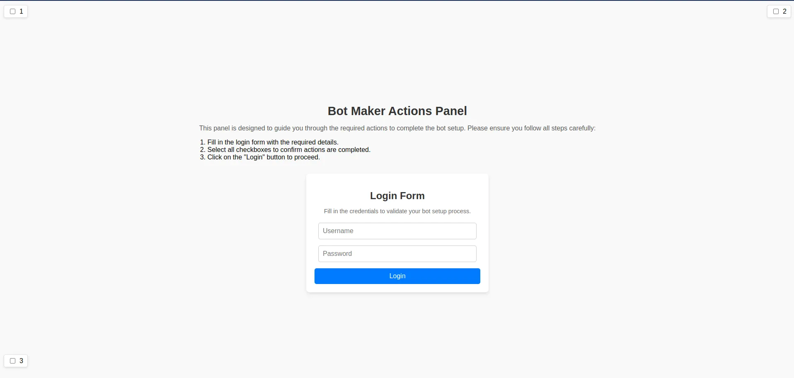
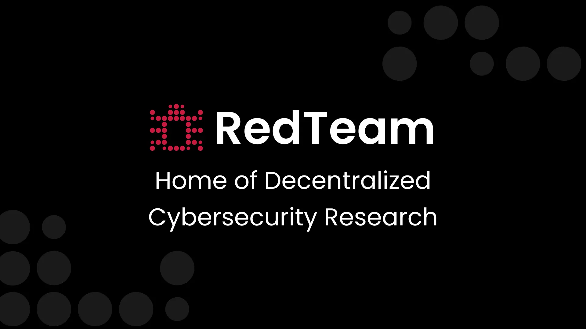
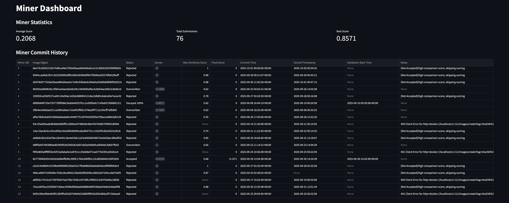

  <h1>Blog</h1>
  
Welcome to the RedTeam Subnet blog. Stay up to date with the latest announcements, research, and technical insights.

  <article class="blog-post">
    

      <h2><a href="posts/dynamic-tao-alpha-token/">Alpha Token & Dynamic TAO: Supercharging RedTeam's Decentralized Cybersecurity Ecosystem</a></h2>
      
Discover how Dynamic TAO and Alpha Token reshape RedTeam's decentralized cybersecurity and incentive model.

      

        Feb 1, 2025
        ·
        Security Research, News
      

    

    

      
    

  </article>

  <article class="blog-post">
    

      <h2><a href="posts/monetization-opportunities/">Unlocking Value: Monetising RedTeam's Outputs and Challenges</a></h2>
      
As RedTeam continues to evolve, we're excited to share how its unique ecosystem offers opportunities for monetisation.

      

        Jan 25, 2025
        ·
        Security Research, Tutorials
      

    

    

      
    

  </article>

  <article class="blog-post">
    

      <h2><a href="posts/bot-detection-challenges/">Bot Challenges Arrive to RedTeam</a></h2>
      
We are excited to introduce the new wave of bot detection challenges + many other updates that have just been released to Subnet 61.

      

        Jan 9, 2025
        ·
        Challenges, News
      

    

    

      
    

  </article>

  <article class="blog-post">
    

      <h2><a href="posts/an.structure-update/">Update in Subnet Structure</a></h2>
      
Major changes to protect miners intellectual property: hidden Docker Hub IDs, encryption detection, and dashboard improvements.

      

        Oct 2, 2024
        ·
        Announcement, News
      

    

    

      
    

  </article>

