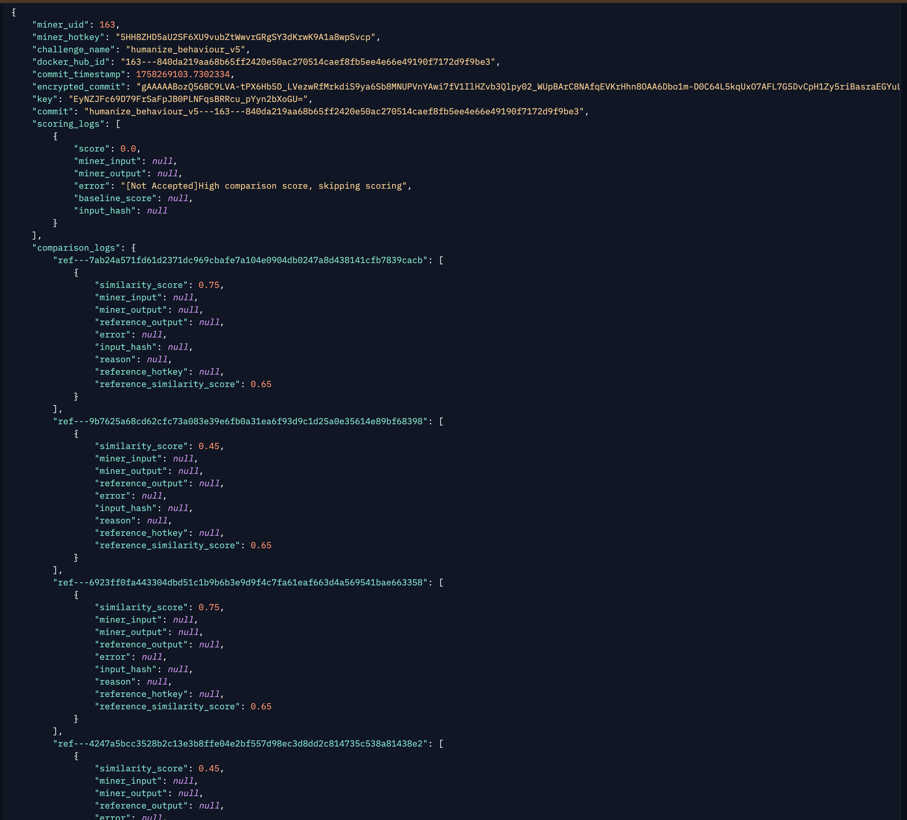

---
date:
    created: 2025-10-02T14:40:00
authors:
  - javokhir
categories:
  - Announcement
  - News
tags:
  - Dashboard
  - Structure
  - DFP
readtime: 5
title: Subnet Announcement
---

## Update in Subnet Structure

We are making important changes to improve fairness and protect miners' intellectual property:

<!-- more -->

### Submission Information Hidden

!!! info "What Changed"
    - From today, submission details especially **Docker Hub IDs** will no longer be visible.  
    - Instead, they are replaced with:
      - On HuggingFace: `miner_uid---docker_hub_sha_digest`  
      - In comparison logs: `ref--docker_hub_sha_digest` (since reference commits should not expose even UIDs).  
    - **Reason:** We observed that some of the highest-scored scripts were developed by a single miner but submitted by multiple miners, leading to unfair distribution of effort and rewards.  
    - This ensures each miner fully owns their intellectual property.

**Example (HuggingFace View):**  

### Encryption Check for Submissions

!!! warning "New Rule"
    - We noticed attempts to bypass similarity checks using encrypted submissions.  
    - To address this, we have integrated an **encryption detection system**.  
    - Each submission will now be checked carefully, and if encryption is detected, the `reason` field in `comparison_logs` will clearly explain the issue.

### Dashboard Updates

**Example (Updated Dashboard):**  

!!! note "Highlights"
    - Removed the **docker_hub_id** column.  
    - Added new columns:  
      - **Miner UID**  
      - **Digest** (Docker image digest).  
    - **Scored Time** now shows the time when the submission was scored by the **scoring server**.  
    - **Validation Start Time** shows when the accepted commit reached validators.  
      - This timestamp will also be used to calculate **decay**.

---

These updates are designed to keep the system **fair, transparent, and supportive** of miners' contributions.
