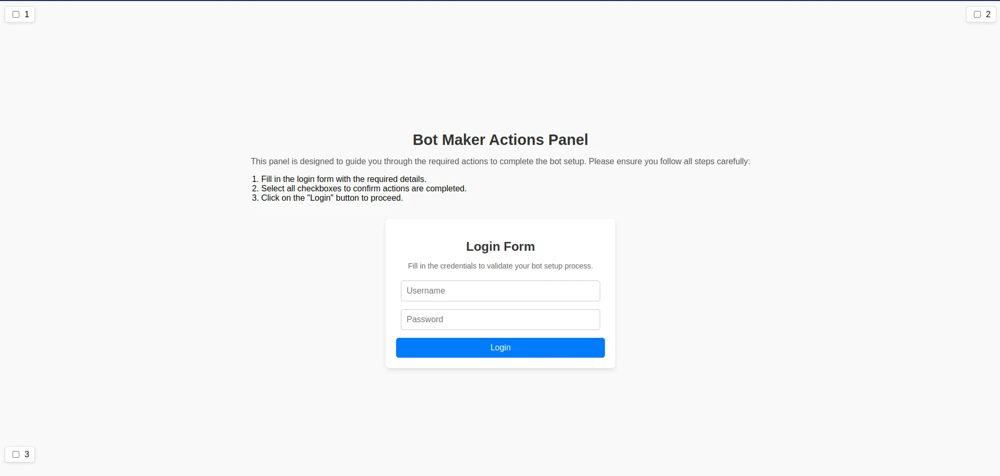

---
date:
    created: 2025-01-15T14:00:00
authors:
  - oscar
categories:
  - Challenges
  - News
tags:
  - Bot Detection
  - Updates
  - Subnet 61
readtime: 5
---

# Bot Challenges Arrive to RedTeam

We are excited to introduce the new wave of bot detection challenges + many other updates that have just been released to Subnet 61!

<!-- more -->

Bot detection will be the first pillar of cybersecurity research to make it's way to our modular challenge pool. Here we will be asking miners to continuously develop/utilise cutting edge bot technology to circumvent various detection methodologies. Miners will integrate these solutions into a base bot.py script that completes the user flow of a login page (as seen below).

Miners are tasked with augmenting this script however they please, to bypass the detection of the specific challenge. In this first challenge, we are asking miners to bypass traditional behavioural analysis, where the mouse movements of the bots are tracked and analysed for non-human / anomalous behaviours. Once Miners are happy with their scripts, they then need to dockerize the solution, and update their active_commit.yaml tag for the active challenge prior to running their miner.

## Full List of Subnet Updates

### 1. New Challenges Added

Added webui_auto (bot detection via mouse movements) and updated versions of existing challenges: response_quality_ranker_v2, response_quality_adversarial_v2

These new challenges will become active on Jan 15th, 2025, at 14:00 UTC. At the same time, the incentive weight for old challenges (response_quality_ranker, response_quality_adversarial) will be set to 0.

### 2. Score Calculation Updates

Submission scores will now be adjusted by subtracting baseline score achieved with same input.

### 3. Validator Optimizations

- Improved resource management for validators after completing evaluations
- Added logs for errors encountered during running miner submissions
- Fixed previous issues with score updates
- Validators now with public ChallengeRecords for better transparency

### 4. Centralized Scoring Enhancements

Enhanced stability in centralized scoring to help newly joining validators achieve high Vtrust more efficiently.

### 5. New Dashboard Integration

A new dashboard has been introduced: [http://storage.redteam.technology/](http://storage.redteam.technology/)

### 6. CR3 Adoption

RedTeam has now enabled CR3.
