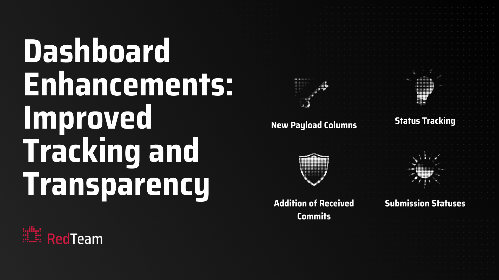

---
date:
    created: 2025-12-25T10:00:00
authors:
  - javokhir
categories:
  - Announcement
  - News
tags:
  - Dashboard
  - Monitoring
readtime: 5
title: Dashboard Update More Visibility and Status Details
---

## Dashboard Updates

We are adding more information to the dashboard to improve monitoring and transparency for your submissions.

### Enhanced Status Tracking

!!! info "What Changed"
    - The dashboard now shows detailed status information for each submission throughout its lifecycle.
    - New statuses include: **Received**, **Accepted | Rejected**, **Validated**, **Invalid**, **Decaying X%**, and **Decayed**.
    - Each status provides clear insight into where your submission is in the evaluation pipeline.
    - New columns provide information about validation outputs, comparison reasons, and scoring results.

**Status definitions:**

- **Received**: New commits received by validators and waiting to be scored.
- **Accepted | Rejected**: Indicates whether a commit is eligible for incentives. Commits in this state are scored but have not reached validators. Pushing a new commit will overwrite this state, and the previous commit will not receive incentives.
- **Validated**: Commits that reached validators after being scored.
- **Invalid**: Commits that failed a specific validation step of the challenge.
- **Decaying X%**: Commits currently decaying; the percentage shows how much has decayed so far.
- **Decayed**: Commits fully decayed and no longer eligible for incentives.

### Three Payload Columns Added

!!! note "Highlights"
    - Added **3 new payload columns** to the dashboard for better debugging and transparency.
    - Each payload provides different information about your submission.

**Payload types:**

- **Validation Output**:
    - Reasons from each verification step.
    - Detailed messages from the validation process.
    - Steps that failed or passed during validation.

- **Comparison Logs**:
    - Score from each comparison.
    - Detailed reasoning behind the similarity score against other submissions.
    - Hidden Docker Hub IDs of compared submissions for privacy.

- **Results JSON**:
    - Available only for challenges that expose a `payload` endpoint.
    - Scoring results for each submission in JSON format.
    - Metrics from each step of the scoring process.

All payloads are displayed in a formatted, collapsible JSON viewer for easy inspection.

### Complete Commit History Now Visible

!!! success "Improvement"
    - The dashboard now displays all commits, including the newest ones.
    - New, unscored commits appear as the first 20 characters of their encrypted commit, prefixed with `encrypted_commit:`.
    - Previously, only the scored commit was visible.

---

These updates are designed to provide better **visibility and transparency** into your submission progress and help you debug issues more effectively.
