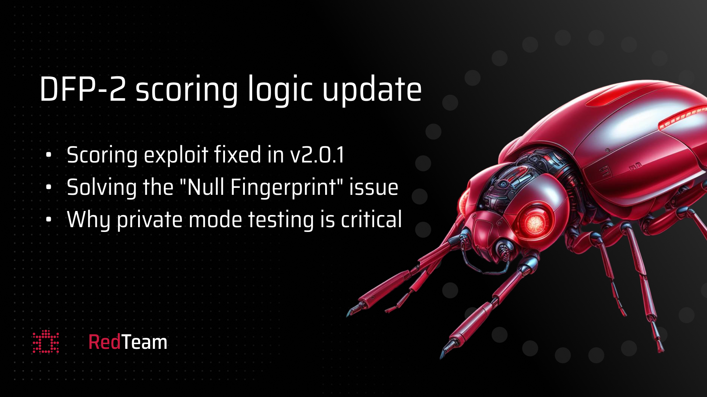

---
date:
    created: 2026-03-10T10:00:00
authors:
  - javokhir
categories:
  - Announcement
  - Release
tags:
  - Challenge
  - Device Fingerprinter
  - DFP-2
readtime: 10
title: "Dev Fingerprinter v2 [DFP-2]: Status Update and Version 2.0.1"
---

# Dev Fingerprinter v2 [DFP-2]: Status Update and Version 2.0.1

We are providing a critical update regarding the current status of the **Device Fingerprinter v2 (DFP-2)** challenge. This update includes details on a recent scoring logic fix (v2.0.1) and essential guidelines for miners to improve their submission success rates.

!!! info "Version 2.0.1 is Live"
    All submissions are now being evaluated under the updated scoring logic to ensure fairness and prevent exploitation of empty results.

## Scoring Logic Fix in v2.0.1

A miner recently discovered a flaw in our scoring logic that allowed for potential manipulation. 

**The Issue:**
Previously, if a script failed to return a fingerprint or returned `None`/`Null`, it was marked as a failure. However, the scoring system excluded these failed attempts from the final average calculation. This allowed a miner to submit multiple "None" results alongside a small number of legitimate, high-scoring fingerprints to artificially reduce the sample size and inflate their overall score.

**The Fix:**
In **version 2.0.1**, we have updated the scoring engine to correctly handle empty or failed returns. Failed attempts are no longer excluded in a way that allows for sample size manipulation, ensuring that only robust and consistent fingerprinters achieve top rankings.

---

## Addressing Common Submission Issues

We have observed that a significant number of recent submissions are failing due to several technical oversights. 

### 1. The "Null Fingerprint" Problem
Many miners' scripts are returning multiple `null` or empty strings. This typically happens when the `runFingerprinting()` function fails to return a proper 32-character hash. 

### 2. Feature Availability (e.g., WebGPU)
A common cause of failure is the reliance on specific browser features like **WebGPU**. If your script attempts to collect features that are not available in a particular browser or device, it may crash or fail to return a fingerprint entirely. 

!!! tip "Resilient Fingerprinting"
    Your logic should be resilient. Ensure your script can handle cases where certain features are missing and still return a consistent, valid hash based on available hardware/software signals.

---

## Essential Guidelines for Testing

To ensure your submission works correctly in our production environment, we strongly recommend following these testing protocols before committing:

### Follow the Testing Manuals
Don't send submissions directly without local validation. Use the official [Testing Manual](https://docs.theredteam.io/latest/challenges/dev_fingerprinter/testing_manuals/) to verify your script in a sandbox environment.

### Hardware Alignment
For the most accurate results, you should test your scripts on multiple mobile devices (or the same device across different sessions) to ensure your fingerprint remains consistent. Our production scoring utilizes real mobile hardware for validation.

### Multi-Browser Coverage in Private Mode
Your SDK is evaluated across 5 mandatory browsers: **Chrome, Brave, Firefox Focus, DuckDuckGo, and Safari**. 

**Crucially:** All testing must be conducted in **Private/Incognito mode**. Our scoring environment runs browsers in private mode, which can significantly affect the availability of certain browser signals and storage mechanisms.

---

## Summary of Action Items for Miners

*   **Update to v2.0.1 Logic:** Ensure your script handles errors gracefully and always returns a valid hash.
*   **Test on Mobile Hardware:** Align your testing hardware with our production environment for better consistency.
*   **Verify in Private Mode:** Ensure consistency across all 5 target browsers in incognito/private sessions.
*   **Consult Documentation:**
    *   [DFP-2 Challenge Overview](https://docs.theredteam.io/latest/challenges/dev_fingerprinter/v2/)
    *   [DFP Testing Manual](https://docs.theredteam.io/latest/challenges/dev_fingerprinter/testing_manuals/)

We look forward to seeing your improved submissions in the DFP-2 challenge!
