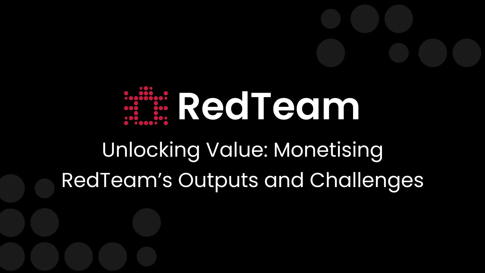

---
date:
    created: 2025-01-20T12:00:00
authors:
  - oscar
categories:
  - Security Research
  - Tutorials
tags:
  - Monetization
  - Miner Outputs
  - Bug Bounty
  - SDK
readtime: 6
---

# Unlocking Value: Monetising RedTeam's Outputs and Challenges

As RedTeam continues to evolve, we're excited to share how its unique ecosystem offers opportunities for monetisation. The core of RedTeam is its innovative approach to cybersecurity challenges and outputs, enabling miners, validators, and third parties to drive significant advancements in the space while creating opportunities for new revenue streams.

<!-- more -->

This post will delve into three key monetisation areas: miner outputs, challenge detection components, and third-party commissioned challenges.

## 1. Monetising Miner Outputs: Leveraging Bot Detection Innovations

At the heart of RedTeam's ecosystem lies the outputs generated by miners participating in bot detection challenges. These outputs, primarily bot scripts, represent sophisticated methodologies designed to bypass specific detection criteria.

These scripts aren't merely exercises in bypassing detection; they are a goldmine for companies aiming to strengthen their cybersecurity defences. For example, a company can use these outputs to:

- **Enhance Detection Systems:** By studying bot scripts crafted to bypass bot detection mechanisms (e.g., UI detection as a specific example of a bot detection challenge), companies can refine and stress-test their own detection systems.
- **Fingerprinting Advancements:** Use bot outputs to improve fingerprinting techniques or develop obfuscation-resistant systems.

By making these outputs accessible (through licensing or partnerships), RedTeam fosters a marketplace where the outputs of ethical red-teaming translate into actionable cybersecurity improvements.

Bot scripts initially designed for the Bittensor page can be augmented for client-specific environments, allowing seamless adaptation of the underlying logic to various web platforms.

A bot detection company like Innerworks could test its detection systems against these scripts, identifying vulnerabilities, iterating improvements, and achieving a 100% detection rate by addressing bypass methods.

## 2. Challenge Detection Components: Packaging for Broader Use

RedTeam's challenges are built on robust detection criteria, often encapsulated within an open-sourced SDK & detection/scoring module. These components serve as a foundational tool for validators and developers to explore serving custom detection solutions to clients.

There's significant commercial potential in:

- **SDK Commercialization:** Validators and developers can package the data collection SDK along with corresponding analytic/scoring components into a product offering. This could cater to businesses looking for ready-made detection solutions.
- **Cross-Challenge Productisation:** Enterprises can bundle various challenge solutions to create niche security products, such as advanced bot detection frameworks or obfuscation-resistant systems.

For example, someone can combine multiple SDKs & components from various challenges into a single, comprehensive detection package, fine-tuned to address specific market needs. This streamlined solution can then be commercialised as a standalone product for clients seeking robust and pre-built security tools.

## 3. Third-Party Commissioned Challenges: A Dynamic Bug Bounty Model

One of the most exciting monetisation avenues is the facilitation of custom challenges commissioned by third parties. This concept transforms RedTeam into a dynamic bug bounty marketplace where enterprises can:

- **Commission Challenges:** Request specific detection scenarios or challenges tailored to their unique requirements.
- **Tap into Subnet Expertise:** Collaborate with the subnet, which facilitates these challenges. Validators or other subnet contributors would likely engage enterprises to secure contracts for these custom bounties.

Revenue from these commissioned challenges would be split based on RedTeam token holding percentages, ensuring fair distribution and incentivizing participation.

Once the dynamic TAO (dTao) governance model is implemented, this process will become even more seamless. Through dTao, stakeholders will vote on which third-party challenges to prioritize, creating a decentralized and transparent decision-making process. Additionally, a portion of the revenue from these bounty contracts will flow back into the ecosystem, rewarding contributors and validators alike.

## Closing Thoughts

In our next blog post, we'll delve into how our Alpha token, through the dynamic TAO update, can potentially enhance each of the three monetization opportunities for subnet 61. Building on the foundation laid out in our previous post about unlocking value through miner outputs, challenge detection components, and third-party commissioned challenges, we'll explore how the Alpha token can serve as a catalyst for these revenue streams.

The dynamic TAO update introduces a new layer of incentivization, potentially allowing for more efficient distribution of rewards from miner-generated bot scripts, streamlined commercialization of challenge detection components, and a more decentralized approach to managing third-party commissioned challenges. By integrating the Alpha token into these processes, we aim to create a more robust, transparent, and participatory ecosystem that not only enhances cybersecurity but also maximizes value for all stakeholders involved in subnet 61's innovative red-teaming framework.
