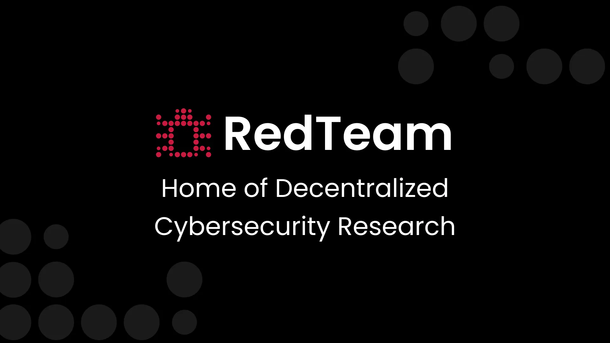

  <h1>Important Information</h1>
  
Critical updates and essential information for RedTeam participants. Stay informed about key policies, guidelines, and requirements.

  <article class="blog-card">
    

      
    

    

      Feb 1, 2025
      <h2><a href="../blog/posts/dynamic-tao-alpha-token/">Alpha Token & Dynamic TAO</a></h2>
      
How Dynamic TAO and the Alpha token reshape RedTeam's decentralized cybersecurity incentives.

    

  </article>

  <article class="blog-card">
    

      
    

    

      Jan 20, 2025
      <h2><a href="../blog/posts/monetization-opportunities/">Unlocking Value: Monetising RedTeam's Outputs</a></h2>
      
Learn how miner outputs, challenge components, and third-party integrations can generate real value in the ecosystem.

    

  </article>

  <article class="blog-card">
    

      
    

    

      Jan 15, 2025
      <h2><a href="../blog/posts/bot-detection-challenges/">Bot Challenges Arrive to RedTeam</a></h2>
      
A new wave of bot detection challenges has been released to Subnet 61, advancing our security testing suite.

    

  </article>

