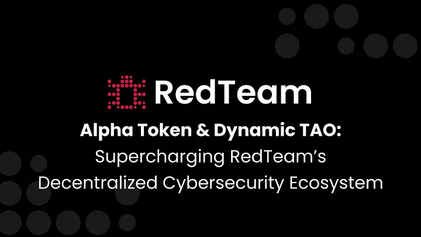

  <h1>Important</h1>
  
Critical updates and important information for the RedTeam Subnet community.

  <article class="blog-post">
    

      <h2><a href="../blog/posts/dynamic-tao-alpha-token/">Alpha Token & Dynamic TAO</a></h2>
      
Discover how Dynamic TAO and the Alpha Token reshape RedTeam's decentralized cybersecurity and incentive model.

      

        Feb 1, 2025
        ·
        Security Research, News
      

    

    

      
    

  </article>

  <article class="blog-post">
    

      <h2><a href="../blog/posts/bot-detection-challenges/">Bot Challenges Arrive to RedTeam</a></h2>
      
A new wave of bot detection challenges has been released to Subnet 61, advancing our community-driven security testing.

      

        Jan 15, 2025
        ·
        Challenges, News
      

    

    

      
    

  </article>

